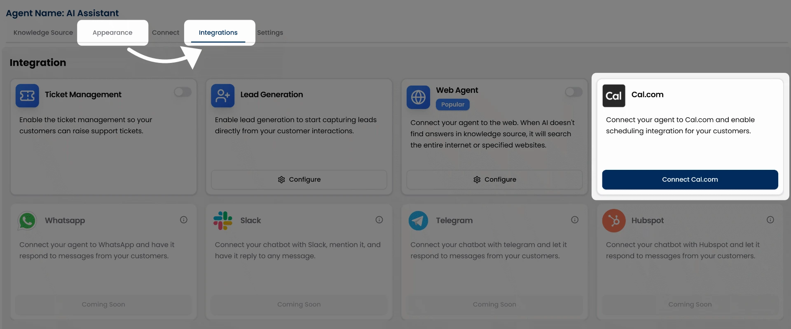
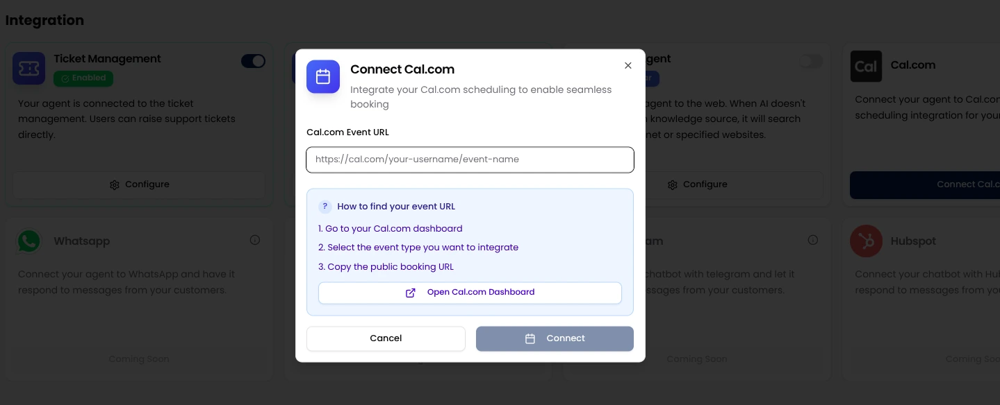
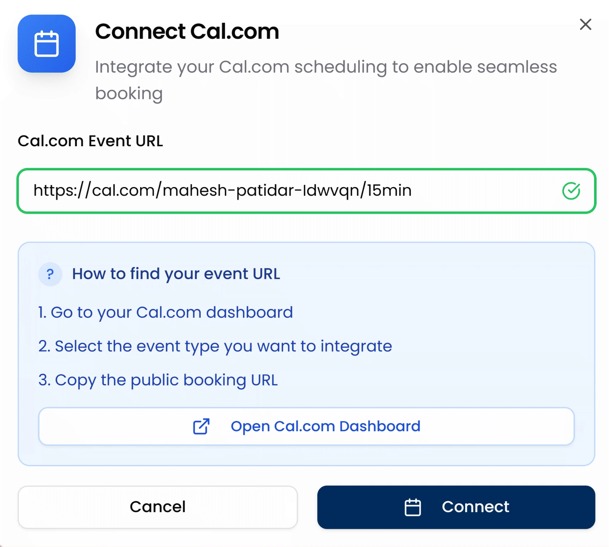
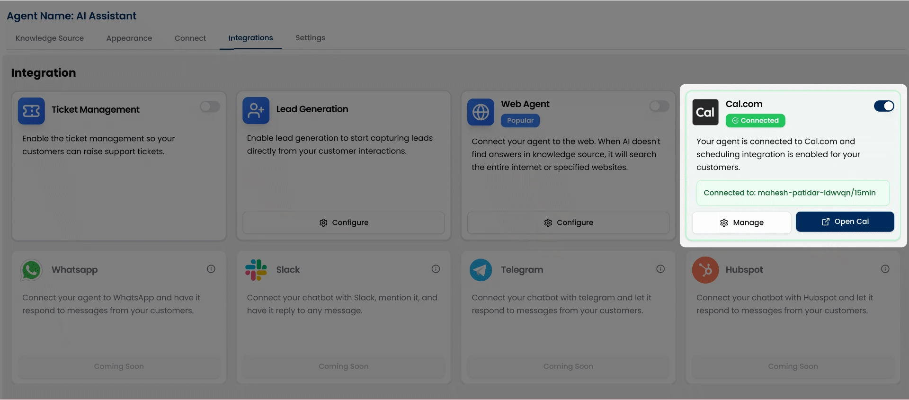
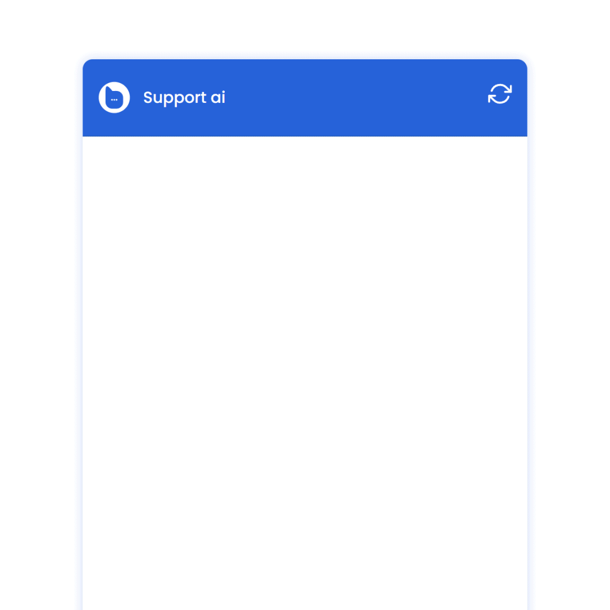

Users can schedule calls in just a few steps, without ever leaving the conversation. This frictionless flow not only improves the customer experience but also increases the chances of demo bookings through a faster, more efficient process.

## How to Enable Cal.com Integration

Go to your **Chat Agents** dashboard.

Click “**View Agent**” under the agent you want to connect integrations with. This opens the agent’s settings page, starting with the Appearance tab.

Switch to the **Integrations** tab in the top navigation.

You’ll see a **Connect Cal.com** button. Click it to add your Cal.com event URL and complete the connection.

## How to Connect Your Event URL

To connect your booking link:

<Steps>
  <Step title="First Step:">
   Click the **Connect Cal.com** button.
   
  </Step>
  <Step title="Second Step:">
   Paste your Cal.com booking URL in the input field.
      

You’ll see a field where you can enter your personal or team Cal.com booking link for example:`https://cal.com/yourname/demo-call`

  </Step>
  <Step title="Third Step:">
   Click **Connect** to link your Cal.com account with the AI agent.

         
Your AI agent is now ready to offer meeting bookings directly from the chat.

<Tip> You can create or manage your Cal.com booking links from your Cal.com dashboard.</Tip>
  </Step>
</Steps>

### Where to Find Your Cal.com Event URL

1. Log in to your [Cal.com](https://cal.com) dashboard.
2. Go to the **Events** section and select the event you want users to book.
3. Copy the **public event URL** (e.g., https://cal.com/yourname/meeting).
4. Paste this into the Botric integration input field and click Connect.

## Preview in Chat

Once your Cal.com URL is connected, your AI Agent will automatically detect user intent to schedule a call or meeting.

For example, if a user types:

* “Can I book a demo?”
* “I want to schedule a call”
* “Need to speak with your team”

The agent will respond with a button like **Book a Call**.

When clicked, it opens the Cal.com booking interface right inside the chat.

This creates a smooth and frictionless booking experience for your customers and helps you convert conversations into real meetings effortlessly.

See how users can book a meeting in the demo video below.

<Frame>
  
</Frame>

## Where the bookings go

All meetings scheduled through the chat agent are visible in your Botric dashboard under the **Scheduled Calls** section on the left sidebar.

You can track and manage all upcoming bookings from there. Each event is also synced with your connected Cal.com account, so everything stays up to date automatically.

<Card
  title="View & Manage Bookings"
  icon="link"
  href="/integrations/cal"
  arrow="true"
  cta="Go to Scheduled Calls"
>
For a better understanding of how to view and manage scheduled calls, check out the Scheduled Calls section of the documentation.
</Card>