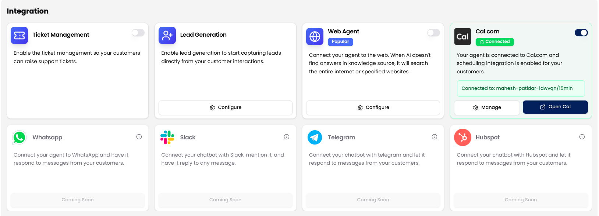
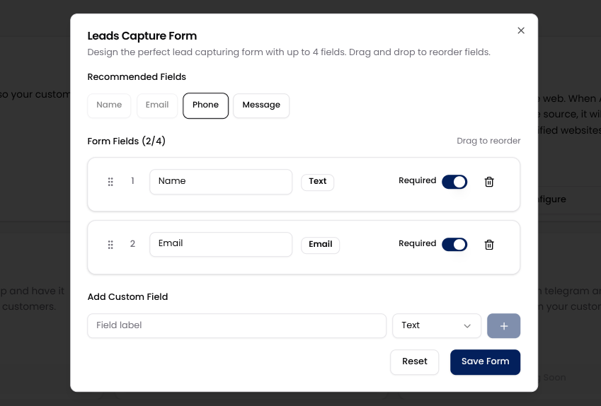
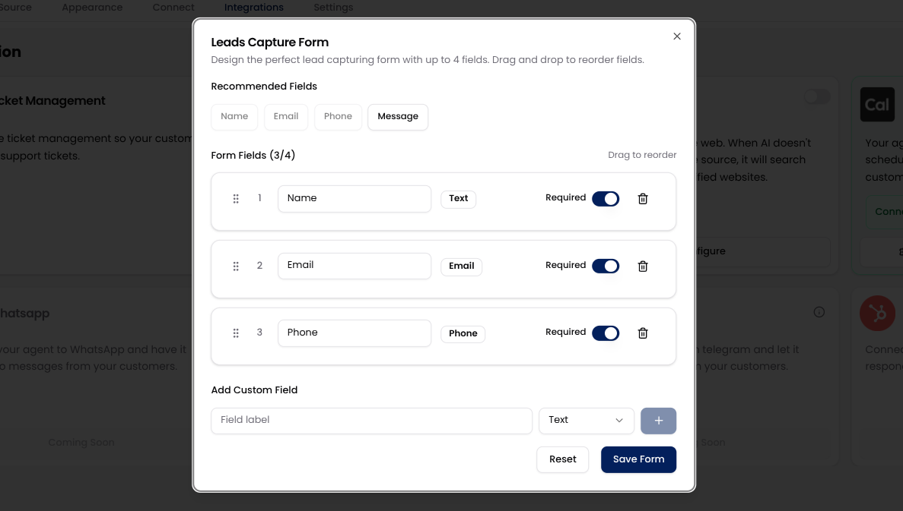
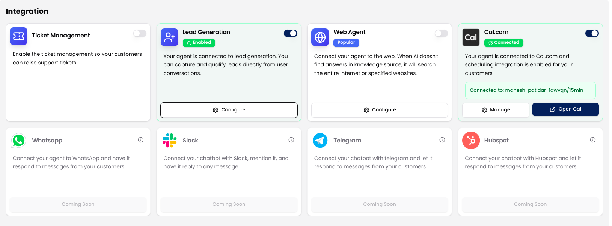

With Lead Generation enabled, your AI agent can smoothly collect valuable information such as a visitor’s name, email, phone number, or a quick message directly within the conversation. There's no need for clunky forms or manual follow-ups.

It’s a simple and seamless way to ensure your agent isn’t just chatting with users, but actually capturing leads you can follow up on.

## How to Enable and Configure Lead Generation

Follow these steps to activate and customize the lead capture process:

<Steps>
  <Step title="Go to the Lead Generation Integration">
  Navigate to the Lead Generation card under the Integrations tab in your dashboard.

   
  </Step>
  <Step title="Click on Configure">
   Click the **Configure** button to open the **Leads Capture Form**.
      

<Info> There's no toggle or activation step, configuring the form is all you need to start capturing leads.</Info>
  </Step>
  <Step title="Set Up Your Lead Capture Form">
         
Inside the form editor, you can customize your fields:

    - Choose from recommended fields: **Name, Email, Phone, Message**.
    - Add up to **4 fields total**.
    - Mark any field as **Required**.
    - Reorder fields using **drag and drop**.
    - Add custom fields by entering a label and selecting the field type (Text, Phone, Email, or Message).

<Warning>To ensure smooth conversations, the form supports a maximum of 4 fields.</Warning>
  </Step>

  <Step title="Save Your Configuration">
  Once done, click **Save Form**. Your AI agent will now prompt users to fill out this form.

         
  </Step>
</Steps>

## Accessing & Managing Captured Leads

All leads captured through your chat agent are stored in the Leads section of your Botric dashboard, accessible from the left sidebar. You can review user details, contacts, and take follow-up actions from there.

Additionally, you’ll receive an email notification each time a new lead is submitted through the form.

<Card
  title="View & Manage Leads"
  icon="link"
  href="/integrations/lead_generation"
  arrow="true"
  cta="Go to Leads"
>
To explore how to manage, track, and view your leads, visit the Leads section of the documentation.
</Card>
