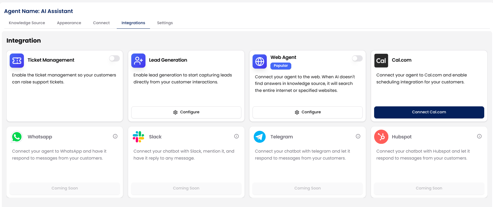
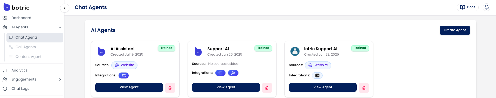
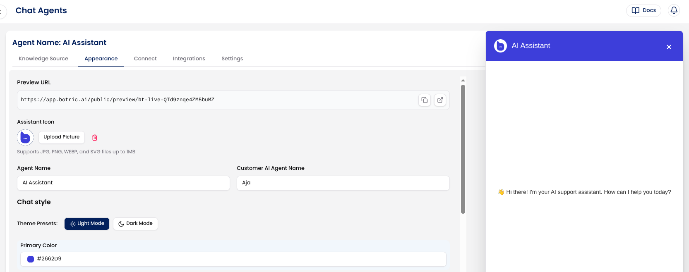

Integrations are modular and optional. You choose which tools to connect, and you can configure each one independently based on your business needs.

## Why Integrate?

Integrations let your AI agent do more than just answer questions; they allow it to take real actions across your existing tools.

Instead of stopping at a response, your agent can:

- Create a support ticket when a user reports an issue.
- Capture lead details when someone shows interest.
- Let customers book meetings, demos, and more.

These actions happen directly inside the conversation, without needing human intervention or switching tools. 

### Available Integrations

Here’s what you can connect today:

- **[Ticket Management](/integrations/ticket_management)** → Allows users to log support issues as tickets.
- **[Lead Generation](/integrations/lead_generation)** → Capture contact details and qualify leads instantly.
- **[Cal.com](/integrations/cal)** → Allow users to book meetings directly inside the chat.
- **[Web Agent](/integrations/web_agent)** → Expand your agent's knowledge by letting it search the web.

<Info>Click any of the integrations above to learn how to connect and configure each one.</Info>

And since they’re built into the Botric platform, you don’t need to write any code to set them up. Just connect, configure, and you’re live.

## How to Integrate Tools with Your AI Agent

There are two ways you can integrate external tools into your AI Agent:

### Option 1: During Agent Creation

While creating your AI agent, you’ll see a step called **Integrations**.

- From here, toggle on the tools you want to use.
- Customize settings for each integration (e.g., setting a Cal.com link or defining lead fields).

This helps you launch your agent with everything ready to go.

<Note>You can skip this step if you’re not ready; it’s always available later.</Note>

### Option 2: After Your Agent Is Created

Already created your AI Agent? No problem. You can add or remove integrations at any time.

From the left-hand sidebar in your dashboard, go to **AI Agents → Chat Agents**. You’ll see a list of all the AI agents you’ve created.

Click “**View Agent**” under the agent you want to connect integrations with. This opens the agent’s settings page, starting with the **Appearance** tab.

Switch to the **Integrations** tab in the top navigation.

From here, you can:

- Turn individual integrations **ON or OFF**.
- **Configure** tools like Lead Generation, Cal.com, or Ticket Management.
- **Add new integrations** as needed.
- Remove or edit existing ones anytime.

Changes are applied instantly, no redeployment needed. This makes it easy to update your agent as your workflows evolve.

## Coming Soon

We’re actively building deeper integrations with:

- WhatsApp
- Slack
- Telegram
- HubSpot

These will allow your agent to operate natively in more channels and sync deeply with your CRM.
