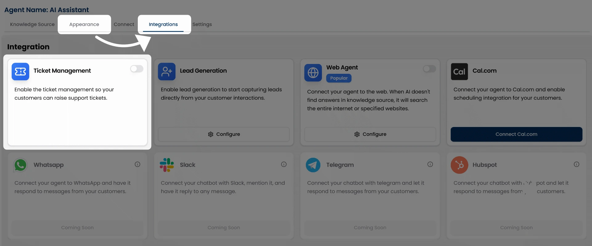
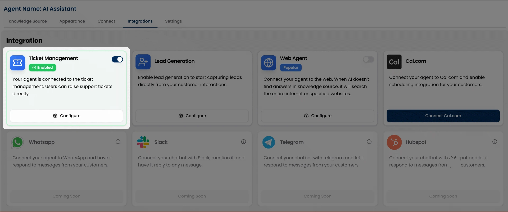
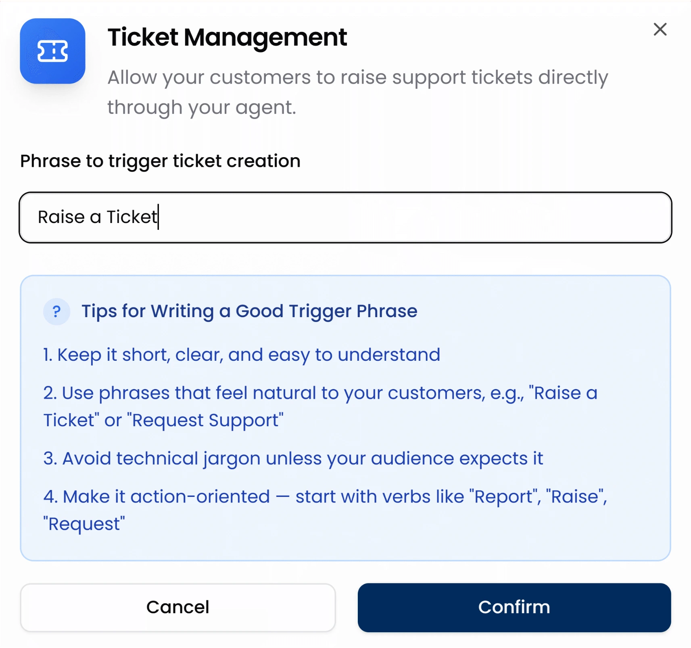
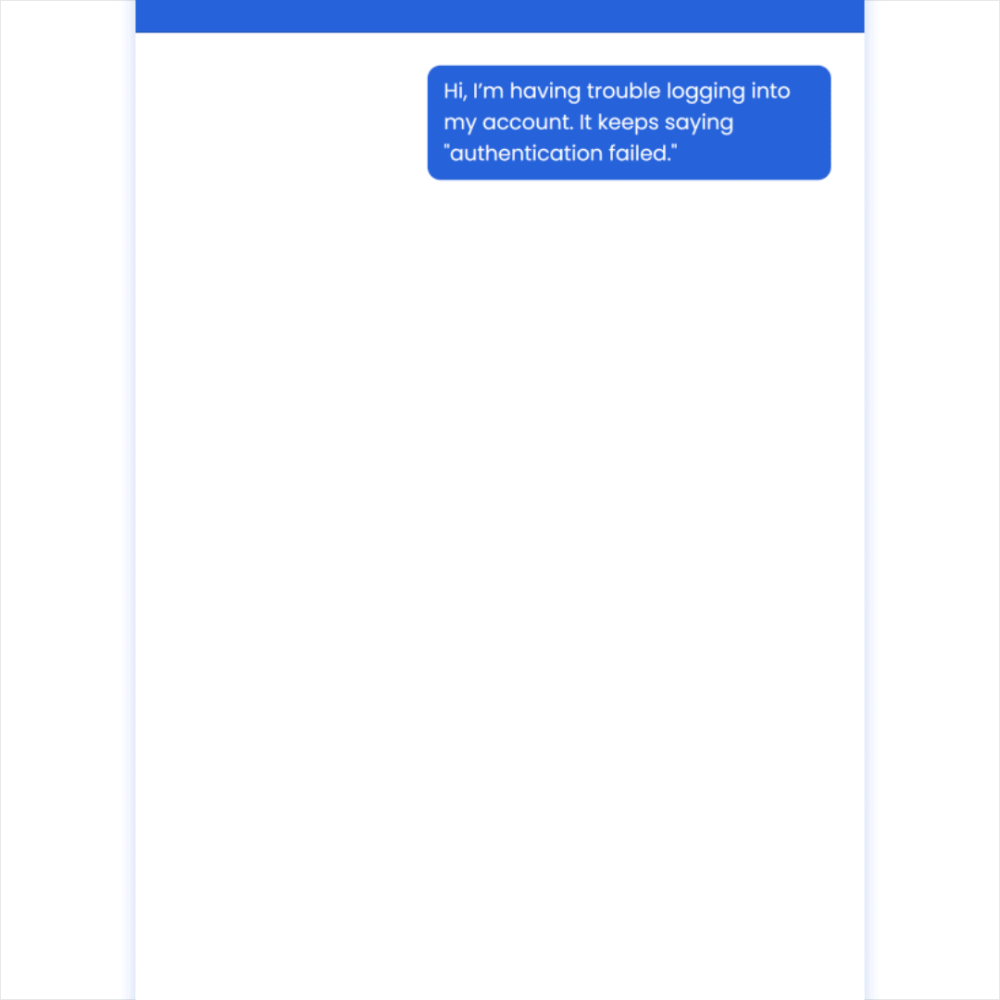

With the Ticket Management integration enabled, your AI Agent understands when customers need help or support and instantly provides a way to raise a ticket.

When users ask for assistance, the agent displays a simple form where they can enter their name, email, and issue details, and then submit it as a support ticket immediately.

## How to Enable Ticket Management

We made the process of enabling ticket management quite simple. All you need to do is go to your **AI Agents → Chat Agents** dashboard and click **View Agent** on the agent you’d like to update.

Click “**View Agent**” under the agent you want to connect integrations with. This opens the agent’s settings page, starting with the Appearance tab.

Switch to the **Integrations** tab in the top navigation.

Click the toggle button in front of **Ticket Management** to turn on support tickets.

<Note>For a step-by-step walkthrough of accessing and managing integrations, see [Integration Overview](/integrations/overview). </Note>

## Configuring a Trigger Phrase

Once you’ve turned on the Ticket Management integration. 

Click the **Configure** button to set your custom trigger phrase.

You’ll see an input box where you can define a phrase like:

* “Raise a ticket”
* “Report an issue”
* “Submit a support request”

After entering your phrase, click **Confirm** to save it.

This trigger phrase tells the chat agent when to show the support ticket form. But here’s where it gets powerful.

## How the Trigger Works in Real Conversations

myIDFI AI agents are smart. They understand user intent from natural conversation. 

So whenever users ask for support in a natural way, like saying:

* “I need help configuring this.”
* “Can someone assist me?”
* “I want support to sort this issue out.”

The agent can recognize the context and respond with a button using the trigger phrase you configured (e.g., “Raise a Ticket”).

Once the user clicks the button, the agent will prompt them with a simple form to collect:

* Name
* Email
* Issue description

The user fills it out and hits **Create Ticket**; that’s it. The ticket is instantly logged.

Isn’t it beautiful to let users raise a support ticket from the chat agent itself? **Yes, it is.** It removes barriers, reduces friction, and dramatically improves your support experience.

## Preview in Chat

Here’s how the ticket creation process looks from the user’s side in the chat agent:

  

## Where the tickets go

All tickets submitted through the chat agent are visible in your myIDFI AI dashboard under the **Tickets** section on the left sidebar. You can track and manage all support tickets from there.

Moreover, you’ll also receive an email notification whenever a user raises a ticket.

For a better understanding of how to view, and manage submitted tickets, check out the Tickets section of the documentation.

<Card
  title="View & Manage Tickets"
  icon="link"
  href="/integrations/ticket_management"
  arrow="true"
  cta="Go to Tickets"
>
 For a better understanding of how to view and manage submitted tickets, check out the Tickets section of the documentation.
 </Card>

 