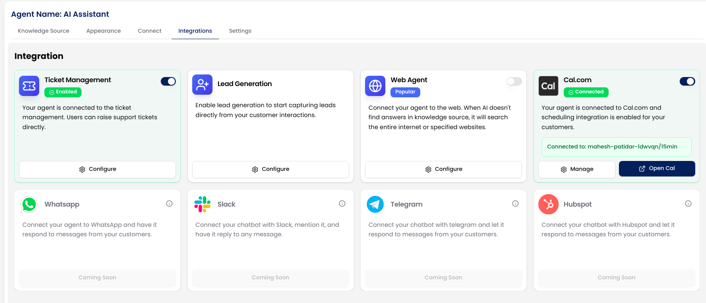
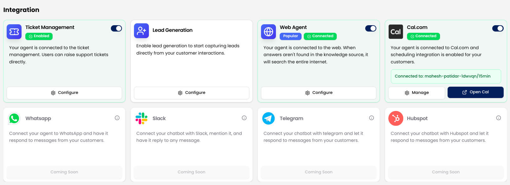
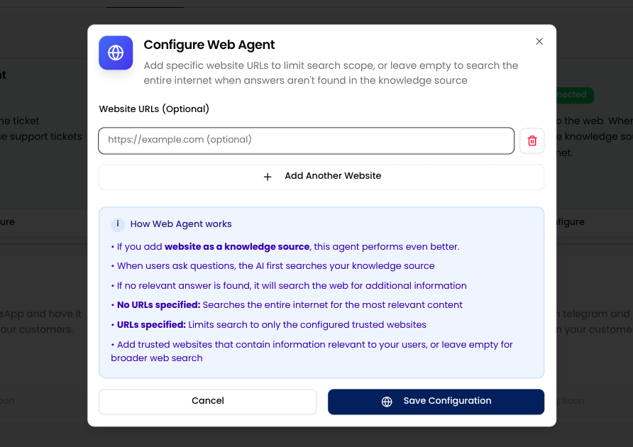

When enabled, the Web Agent acts as a fallback search method. It first looks into your internal knowledge base (files, links, websites, etc.), and if no suitable answer is found, it fetches content from the web. 

You can choose to limit web search to specific trusted websites by adding their links, or allow the agent to search the entire internet when no internal answer is found.

## Why Use the Web Agent?

The **Web Agent** boosts your AI assistant’s ability to handle edge cases or missing content without requiring constant manual updates.

By enabling this feature, the agent first searches your configured knowledge sources and, if no relevant answer is found, expands its search to the wider web. This ensures that your users receive the most accurate and complete responses without hitting dead ends. 

You can choose to restrict the search to trusted websites for more control, or leave it open for broader coverage.

<Tip>To improve response quality, we recommend adding websites that are closely related to your industry or domain.</Tip>

## How to Enable and Configure Web Agent

Follow these steps to enable the Web Agent and set up custom search preferences:

<Steps>
  <Step title="Open Integrations">
  Go to your **Chat Agents** dashboard and click **View Agent** for the one you want to update. Then, navigate to the Integrations tab.
   
  </Step>
  <Step title="Enable the Web Agent">
   Locate the **Web Agent** card and toggle the switch to turn it on.
      

  </Step>
  <Step title="Click Configure Button">
   Once enabled, click the **Configure** button to open the settings modal.

         
  </Step>

  <Step title="Add Trusted Websites (Optional)">
    In the configuration modal:
    - You can enter up to **10 website URLs** to restrict the search scope to trusted sources.
    - Click “**+ Add Another Website**” to include multiple links.
    - Leave the list empty if you'd prefer the AI to search the entire internet when no match is found in your knowledge sources.

  </Step>

  <Step title="Save Configuration">
   Once you've added the desired websites (or left it blank), click **Save Configuration** to apply your settings.

         
  </Step>
</Steps>

## How Web Agent Works

- When a user asks a question, the AI first searches your connected knowledge sources (documents, files, links, text).
- If no relevant information is found:
        - If URLs are specified: The agent will only search the configured websites.
        - If no URLs are specified: The agent will search the entire internet.
- The best answer is selected and shown to the user.

## Best Practices

- **Use reliable sources**: Add websites that publish factual, up-to-date, and relevant content.
- **Keep it industry-specific**: Include links that reflect your business niche (e.g., your docs, blog, or trusted third-party sites).
- **Max 10 websites**: Keep your source list focused to maintain performance and answer quality.
- **Avoid vague or low-quality sources**: These can reduce answer precision and user trust.