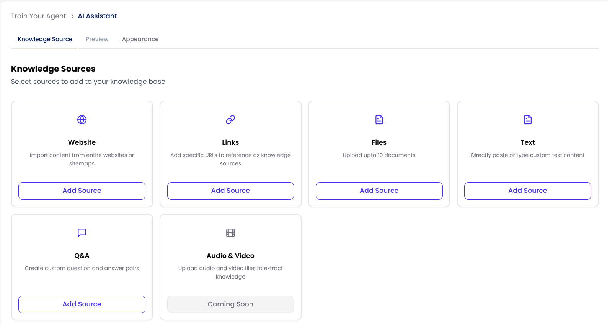
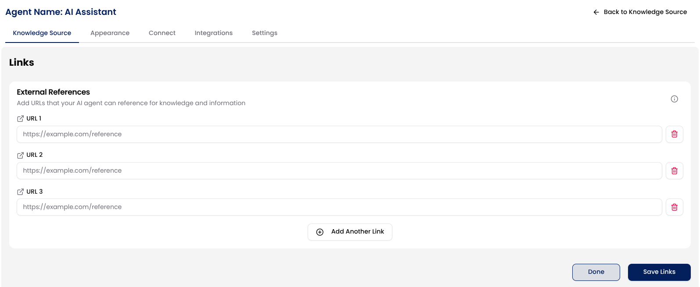
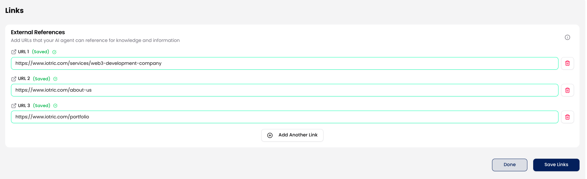
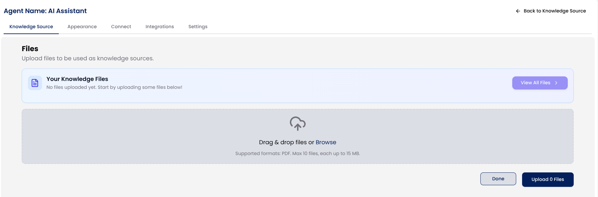
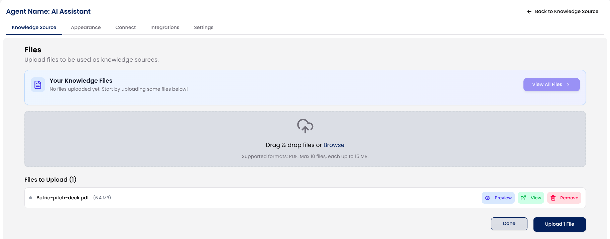
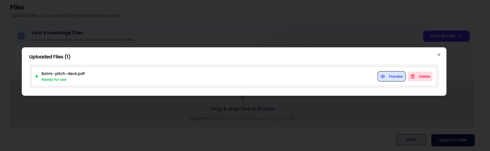
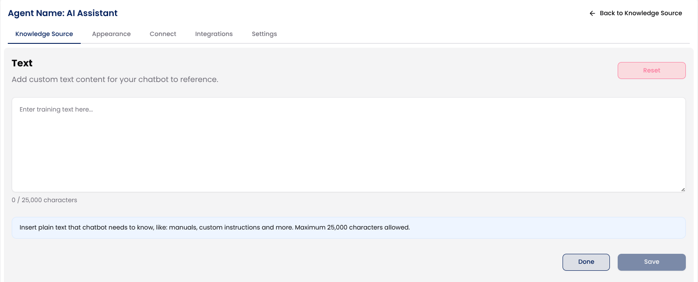
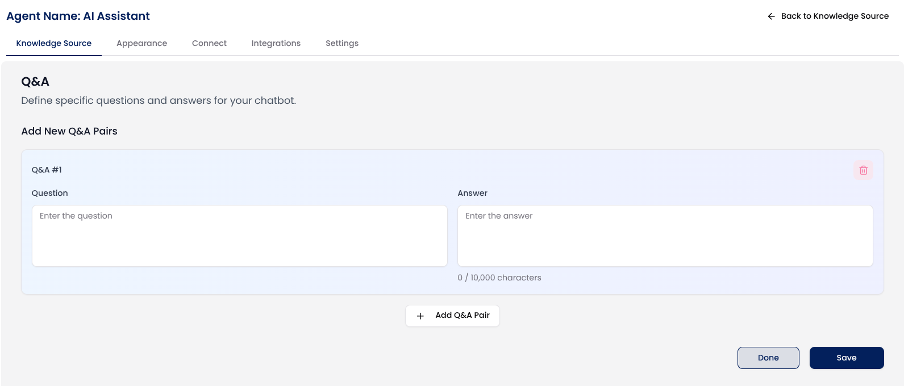

## Overview

Botric lets you train your AI support agents using multiple types of knowledge sources so they can answer customer queries more accurately and naturally.

We’ve designed this to be as simple and flexible as possible so even non-technical users can bring in their company’s knowledge and turn it into a powerful AI assistant.

You can import content from:

- Your own website (via URL or sitemap)
- Specific external links
- Files (PDFs)
- Text or Q&A pairs you manually provide
- Video and audio

Once imported, Botric’s AI engine processes and segments this information for accurate training and fast retrieval.

##  1. Website (Crawl by URL or Sitemap)

Let your agent learn from your website content by simply adding a URL or sitemap.

#### How it works:

- Click **Add Source** under the "**Website**" tab.
- Paste your website or sitemap URL.
- Click **Fetch** to crawl the site.
- Botric will automatically collect all crawlable pages, product pages, FAQs, help articles, blogs, etc.
- You can preview the full list of pages and manually choose which ones to include or exclude.?
- Click **Save Links** and then **Done** to return to the Knowledge Source overview.

> **Tip**: You’ve already seen this in action while creating your first AI support agent.

## 2. External Links

Use specific URLs from different sites or tools as sources without crawling the whole website.

#### How it works:

Click **Add Source** under the "**Links**" tab from the Knowledge Sources section.

In each field labeled URL 1, URL 2, URL 3, etc., paste the full link to the page you want the AI agent to learn from (e.g., `https://example.com/product-guide`)

To add more links, click the Add **Another Link button**.

Once all the links are added, click **Save Links**, and the chat agent will automatically be trained on them.

Click **Done** when you're finished.

Your agent will now use the content from these URLs as part of its knowledge base to answer relevant questions.

> **Tip**: Make sure the links you provide are public and don’t require login access.

## 3. File Uploads

You can train your agent using helpful documents like user manuals, product guides, onboarding PDFs, or internal wikis.

#### How to upload files:

Go to the "**Files**" tab and click **Add Source** from the Knowledge Sources section.

Either drag and drop your PDF files into the upload area or click **Browse** to choose files from your computer

After selecting your files, you’ll see them listed with options to Preview, View, or Remove.

Click the **Upload File** button to finalize the upload.

Once uploaded, Botric will automatically use the file to train your chat agent.

You can view all uploaded files by clicking the **View All Files** button. You can also remove any file at any time if it's no longer needed.

Once uploaded, click **Done** to return to the main screen.

>✅ Supported format: PDF only.
>📁 Upload up to 10 files at a time, with a maximum size of 15 MB per file.

## 4. Text Content
You can also manually add any custom information you want your chat agent to know by using the **Text** option. This is useful when you want to add internal instructions, product manuals, or any unique details that aren’t available on your website or files.

#### How to add text content:

Go to the "**Text**" tab and click **Add Source** from the Knowledge Sources section.

Just type or paste your content into the text box and click the **Save** button. You can add up to **25,000 characters** of plain text. If needed, you can click the **Reset** button to clear everything and start over.

This option gives you more control over what the chat agent learns, especially for specific use cases that require tailored information.

Once you're done, click **Save** to train your chat agent with the provided information. Use the **Done** button to return to the main screen.

## 5. Train with Q&A

If you already have a list of commonly asked questions and answers, you can directly add them to train your chat agent. This method is especially useful for creating focused and accurate responses around your product, services, or support needs.

#### How to Use It:

Go to the "**Q&A**" tab and click **Add Source** from the Knowledge Sources section.

Manually input each **question** and its **corresponding answer** into the provided fields.

Click **Add Q&A Pair** button to input as many Q&A pairs as you like,, and your AI agent will use them as a reliable source to respond to related queries from users.

Once you're done, click **Save** to train your chat agent with the provided information. Use the **Done** to return to the main screen.

> **Tip**: Keep your questions short and specific. For answers, use clear, conversational language that reflects how you want your agent to communicate.

