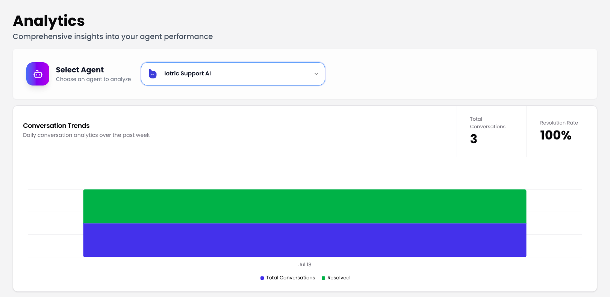
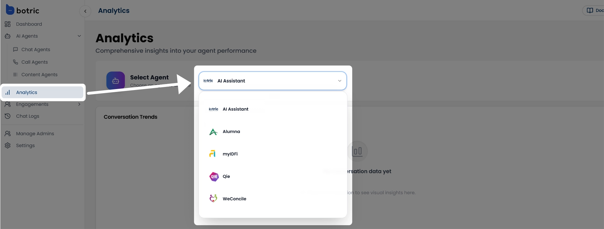
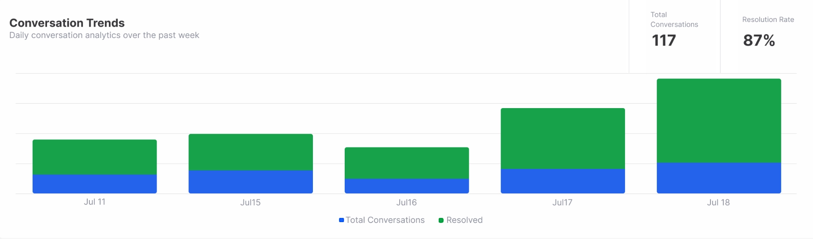
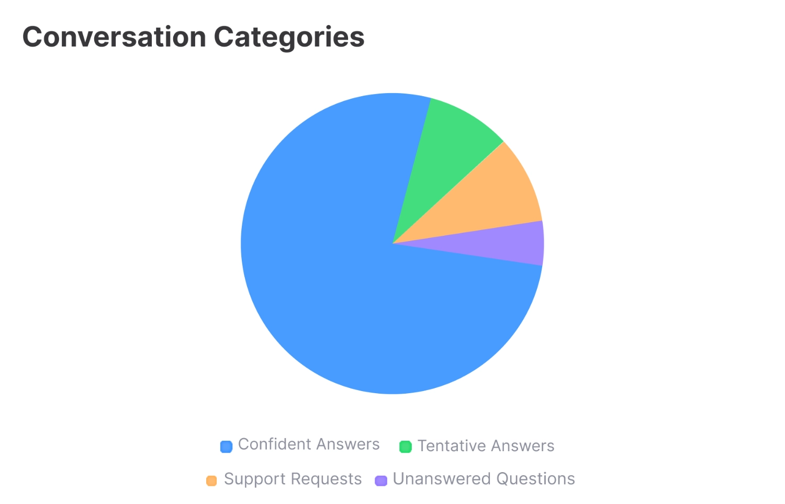
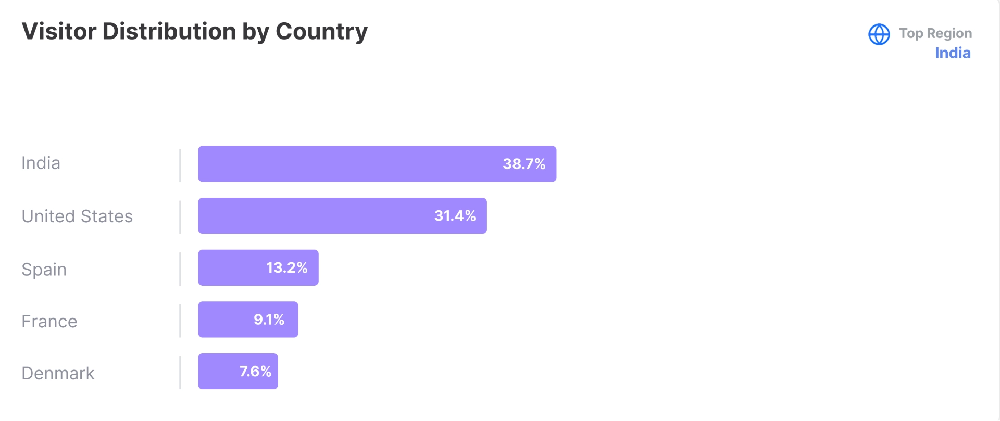

Now that you're familiar with how to build and fine-tune your own AI agents using different types of knowledge sources, it's time to explore how they're performing.

To get started, go to the **Analytics** section from the left-hand sidebar.

The myIDFI AI Analytics feature provides a centralized view of how your AI agent is being used. From tracking conversation volumes to understanding user locations, every metric is designed to help you fine-tune your support experience and maximize ROI.

## What You Can Track

- Select AI Agent to filter data across different agents.
- Monitor daily chat volumes and resolution performance.
- Analyze topics and response categories to spot gaps.
- Track user locations across countries and regions.
- Review recent conversations for quality assurance.

## Select Agent

At the top of the Analytics section, use the dropdown menu to choose the AI agent you want to analyze.

This is especially helpful if you've deployed multiple agents across different websites, teams, or use cases. All analytics below will update based on your selected agent.

## Conversation Trends

The Conversation Trends section offers a detailed overview of your chat agent’s performance over time. It helps you understand how well your agent is engaging with users, resolving their queries, and managing overall interaction load.

You’ll find key metrics such as:

- **Total Conversations**: The total number of user interactions handled by the selected agent.
- **Conversation Volume & Resolution Trends**: This graph shows both Total Conversations (all user interactions with the agent) and Resolved Conversations (those that ended with a successful resolution).
- **Resolution Rate**: The percentage of conversations resolved vs. total conversations.

Tracking these trends gives you valuable insight into performance, helps you identify peak activity times, and highlights areas where improvements or more training may be needed.

## Conversation Categories

myIDFI AI analyzes each conversation and organizes responses into four key categories:

- **Confident Answers**: These are responses the AI provided with high confidence, based on strong matches from the knowledge sources.
- **Tentative Answers**: Responses given with lower confidence, useful for spotting where your content might need improvement or clarification.
- **Support Requests**: Questions that typically require human assistance or fall outside the agent’s current scope. These help identify areas where human-in-the-loop support might be needed.
- **Unanswered Questions**: Queries the agent couldn't respond to. These are key opportunities to expand your knowledge base and improve future performance.

By analyzing these categories, you can continuously refine your AI support agent. This helps increase response confidence, fill knowledge gaps, and ensure more accurate and helpful answers over time. As a result, you enhance customer satisfaction and reduce the need for manual support.

## Visitor Distribution by Country

This graph provides a percentage-based breakdown of visitor locations, showing where your users are coming from based on total activity on your AI agent.

You'll get a clear visual of how traffic is distributed by country, highlighting the top regions driving the most engagement.

Understanding your visitor geography helps you prioritize support languages, localize experiences, and optimize outreach in high-performing markets.

## Recent Conversations

The Recent Conversations section provides a quick overview of how your AI agents are engaging with users in real time. Each entry includes:

- **Timestamp of the Conversation**: Shows when the conversation started, helping you track activity by time and date.
- **User Query Preview**: A short snippet of what the user asked, gives you context on user intent at a glance.
- **Agent’s Response Preview**: A preview of how your AI agent responded, helping you assess the quality and relevance of replies.
- **Message Count**: Displays the number of messages exchanged in the conversation, giving you insight into how long or complex the interaction was.

This view is especially useful for monitoring conversation quality, spotting recurring questions, and continuously improving your AI agents based on actual user behavior.
