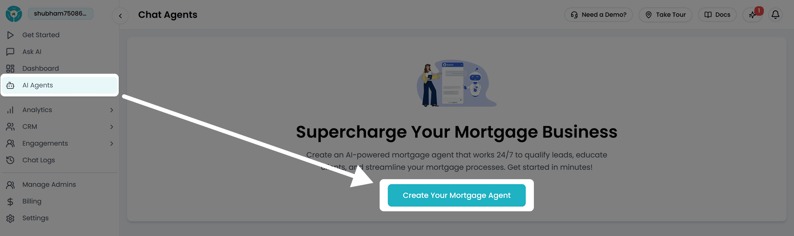
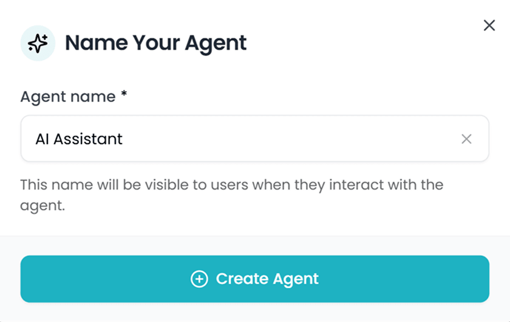
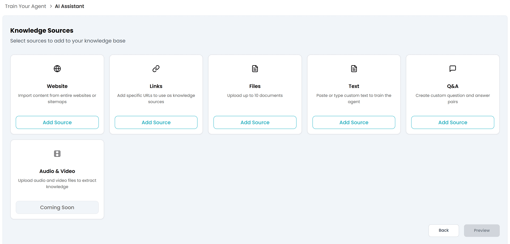
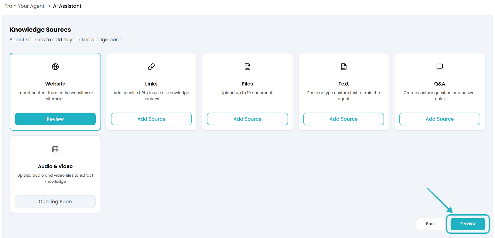
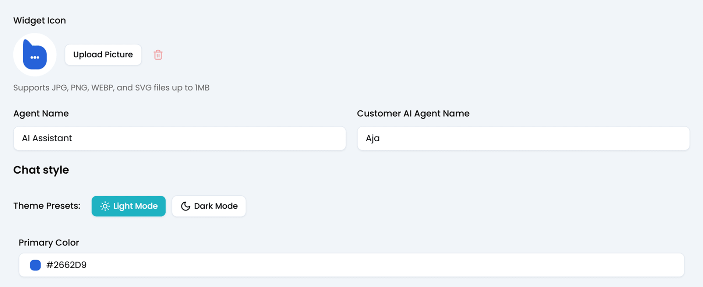
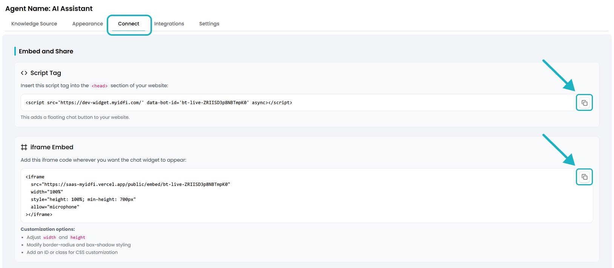

Follow these steps to build your first **Chat Agent**:

## 1. Go to AI Agents → Chat Agents

From the left-hand sidebar, navigate to the **Chat Agents** section and click on **Create Agent**.

<Note> You can also manage, edit, update, or deactivate your existing chat agents from this section anytime.</Note>

## 2. Name Your Agent

Enter a simple and clear name for your agent, like **Support Agent** or **AI Assistant**. This helps keep things organized, especially if you create multiple agents later.

After entering a super cool name for your chat agent, click on **Create Agent** to build your agent and proceed with the setup process.

It takes just a few seconds to create one and move to the next step where you can start training it using your own data.

## 3. Upload Your Data

To help your AI agent respond accurately, you can train it using a variety of content sources. 

Here's what you can add:

- Add your website or sitemap
- Upload files like PDFs.
- Add direct URLs to key pages or knowledge bases
- Paste text or question-answer pairs manually.
- Add videos or audio content

#### Start with Your Website:

You can start training your chat agent by importing content directly from your website or sitemap. Just click “**Add Source**” under the **Website** option to get started.

Paste your website URL and click “**Fetch**”. Our AI engine will automatically crawl your site and pull in useful content from pages like product details, services, and blogs. It’s a quick way to give your agent a solid knowledge base without manual effort.

After that, you can:
- Select specific links to use for training.
- Or click Save Links to include all of them.

Once done, hit the **Done** button to return to the **Knowledge Sources** section.

<Note> You can also train your agent using direct links, file uploads, or plain text. We'll explore each of these methods in detail on the dedicated [Knowledge Sources](/user-guides/Knowledge_sources) page.</Note>

Once you’ve saved your website links, click the **Preview** button in the Knowledge Sources section to view all the content that will be used to train your chat agent.

After reviewing your saved data, click “**Create My Agent!**” to start training your chat agent using your own content.  You’ll then move on to the **Appearance** section.

## 4. Customize Your Agent

In the **Appearance** section, you’ll get a **Preview URL** where you can test your chat agent live.

Copy and open this URL in a browser tab to interact with your agent.

You’ll also find several settings to customize the look and feel of your agent, making sure it aligns perfectly with your brand identity.

You can upload your logo, set the preferred language, update the agent’s name, choose a primary color, and switch between light and dark themes.

We’ll cover all these customization options in detail in the **Appearance** section of this documentation.

## 5. Deploy Your Agent

Once you're satisfied with how your chat agent performs, you can easily integrate it into your website using either of the two methods available under the **Connect** tab in the Botric dashboard:

#### 1. Script Tag (Floating Chat Bubble)

This adds a floating chat bubble to your website.

- Simply copy the provided `<script>` tag.
- Paste it inside the `<head>` section of your website’s HTML.

The bubble appears on all pages, letting visitors chat without disrupting layout.

#### 2. iframe Embed (Static Widget Placement)

If you prefer embedding the chat directly into a specific part of your page (like inside a contact section or a dedicated support panel), use the iframe embed option.

- Copy the given `<iframe>` code.
- Paste it wherever you want the chat widget to appear within your page.
- You can adjust:
    - `width` and `height` attributes
    - CSS styles like `border-radius` or `box-shadow`
    - Add an `i`d` or `class` for custom styling

This method offers more control over placement and design flexibility within your existing layout.

## 6. Live Preview

Want to see how the chat agent will appear on your site? Here’s a quick preview of the Iotric **AI Assistant** we just created, embedded on a webpage:

This is exactly how it will look and function once the widget is added to your site using the **script tag method** to display a floating chat bubble.

With everything set up, your chat agent will be ready to support your customers 24/7, helping you deliver a smooth and consistent customer experience. As you’ve seen, the entire process takes just a few simple steps that anyone can follow, even without technical skills.

This simplicity is what makes Botric a powerful solution for expanding AI-driven customer support across industries of all types.

Now that your first agent is live, here’s what you can explore next to enhance its performance and usability.

<Columns cols={2}>
  <Card title="Knowledge Sources" icon="book-open"   href="/user-guides/Knowledge_sources"
  arrow="true"
  cta="Click here">
    Manage and update the data your agent learns from.
  </Card>
  <Card title="Integration" icon="workflow"   href="/integrations/calendly"
  arrow="true"
  cta="Click here">
    Connect your agent to external tools and workflows.
  </Card>
</Columns>

<Columns cols={2}>
  <Card title="Analytics" icon="trending-up"   href="/user-guides/analytics"
  arrow="true"
  cta="Click here">
    Track how your agent is performing. View total conversations, resolution rates, and growth trends.
  </Card>
    <Card title="Chat Logs" icon="history"   href="/user-guides/chatlogs"
  arrow="true"
  cta="Click here">
    Use chat logs to improve agent responses, spot gaps in training, and ensure consistent support quality.
  </Card>
</Columns>