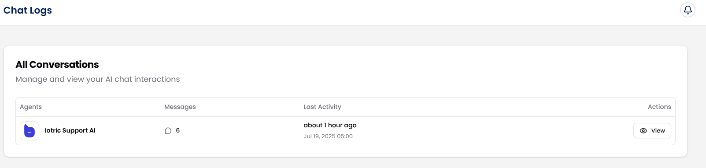
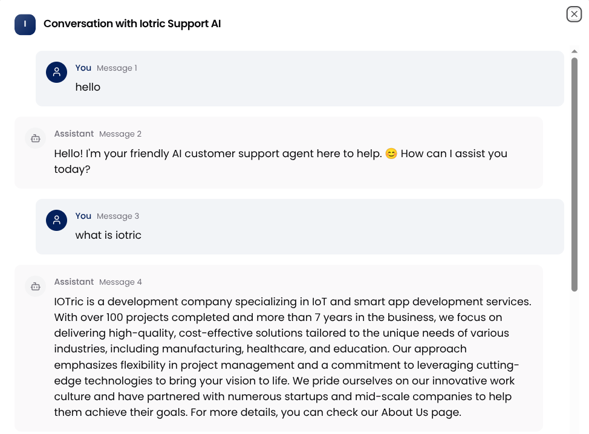

Once your AI agents are active, the **Chat Logs** section becomes your go-to space for reviewing how they’re performing. It gives you full visibility into every interaction, so you can analyze behavior, catch issues, and continuously train better AI agents.

Follow these steps to navigate and use the Chat Logs effectively:

From the left sidebar, click on the **Chat Logs**. This will open a real-time table listing every chat your agents have had with users.

Each row in the chat log table shows a summary of one conversation. You’ll find:

- **Agent**: Which AI agent handled the chat
- **Messages**: Total number of messages exchanged in that conversation
- **Last Activity**: When the conversation last took place (e.g., “2 hours ago”)
- **Timestamp**: The exact date and time the chat started
- **Actions**: Click View to dive into the full chat history

This overview makes it easy to spot which conversations were short, long, frequent, or recent.

Moreover, you can click the "**View**" button next to any chat to see the full, message-by-message exchange.

In the detailed view, you can:

- Read the entire conversation thread between the user and the agent
- Assess how confidently the AI responded (e.g., did it answer, hesitate, or miss?)
- Spot issues, like repeated questions, escalations, or confusing queries

This is where you can really understand how your AI behaves in the wild, and how users are engaging with it.

