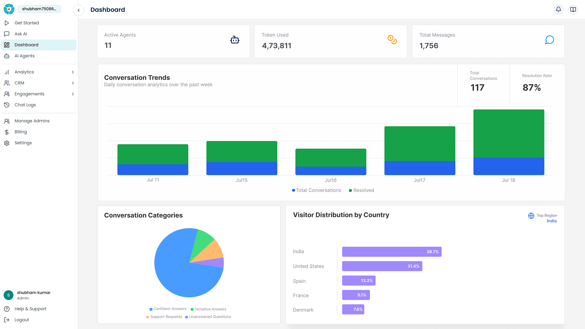
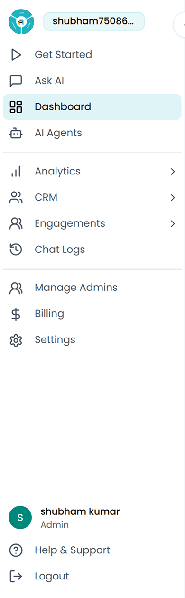
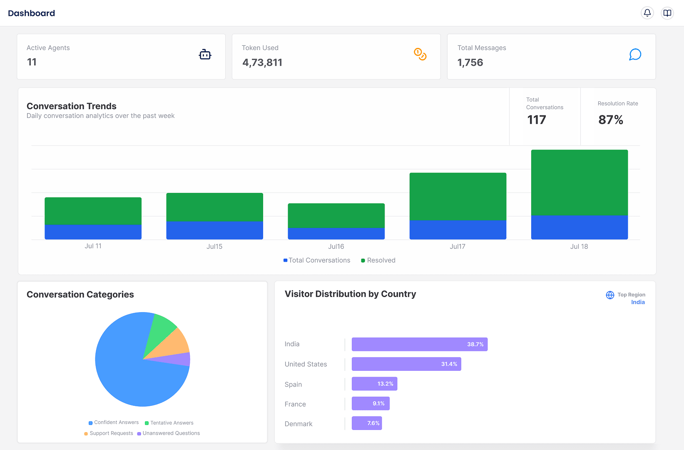

## Prerequisites

To get started, just head over to [app.botric.ai](https://app.botric.ai) and sign up for a new account, or log in if you already have one.

<Note> No credit card required to get started. </Note>

Once you're in, you'll land on the **Botric Admin dashboard** where you can explore powerful and helpful features to manage your custom AI support team (yes, your own team of AI agents) and start building your first one.

This is your control center where you can view system-wide metrics, manage your AI agents, access chat logs, and configure settings.

## Sidebar Navigation

On the left-hand side of the admin dashboard, you’ll find the main navigation menu:

- **Dashboard** – You're here! A quick overview of usage, activity and insights.
- **AI Agents** –
    - **Chat Agents** – Create and manage AI agents that handle customer support through live chat, integrated into your website or app.
    - **Call Agents** – Manage and configure AI-powered voice agents that handle customer calls in real time. 
    - **Content Agents** – Audit, improve, and manage your support content by identifying gaps, enhancing clarity, and expanding coverage to reduce repetitive queries and lower support ticket volume.
- **Analytics** – Dive into deeper insights and performance tracking (once conversations start flowing).
- **Engagements** –
    - **Tickets** – View, assign, and manage support tickets created by your AI agents.
    - **Scheduled Calls** – Manage and track all support calls booked through chat agents, view customer details, and update call statuses with ease.
    - **Leads** – Manage and track sales leads captured through conversations, view lead details, and monitor follow-up status to drive conversions.
- **Chat Logs** – Browse all past conversations for monitoring, QA, or training your AI further.
- **Manage Admins** – Add, remove, or manage admin-level access for your team.
- **Settings** – Manage your account information, billing details, and subscription plans.
- **Help & Support** – Raise and track support tickets, and get direct assistance from our team whenever you need it.

## Dashboard Overview

This screen gives you a high-level view of how your AI agents are performing:

| **Title** | **Description** |
|-----------|-----------------|
| **Active Agents** | Number of AI agents currently active in your workspace. |
| **Token Used** | Total tokens consumed across all conversations, useful for tracking usage. |
| **Total Messages** | Number of messages exchanged between users and agents. |
| **Conversation Trends** | A visual graph that shows how conversations are growing over time, along with total conversation volume and resolution percentage. |
| **Conversation Categories** | Breakdown of agent responses by category (e.g., confident answers, support requests). |
| **Visitor Distribution by Country** | This visual chart shows where your users are coming from, giving you geographic insights for audience targeting. |

## Why Data Might Be Empty

If you're seeing messages like “_No conversation data yet_” or “_No country data available_,” don’t worry! This is expected if your agent hasn’t started interacting with users yet. Once conversations begin, data will appear here automatically.

Think of this dashboard as your support control room. The more conversations your AI agent handles, the more this space transforms into a rich data source, perfect for analyzing performance, identifying gaps, and improving customer experience.

Now that you’re familiar with the dashboard, it’s time to bring your first AI Chat Agent to life.

<Card
  title="Get Started with Your First Chat Agent"
  icon="link"
  href="/user-guides/build_a_chat_agent"
  arrow="true"
  cta="Click here to jump to the setup guide."
>
For users ready to create and deploy their first conversational AI agent.  
</Card>

Once your first agent is live, return to the **Dashboard** to monitor its performance and watch your automated support deliver next-level customer experience.
